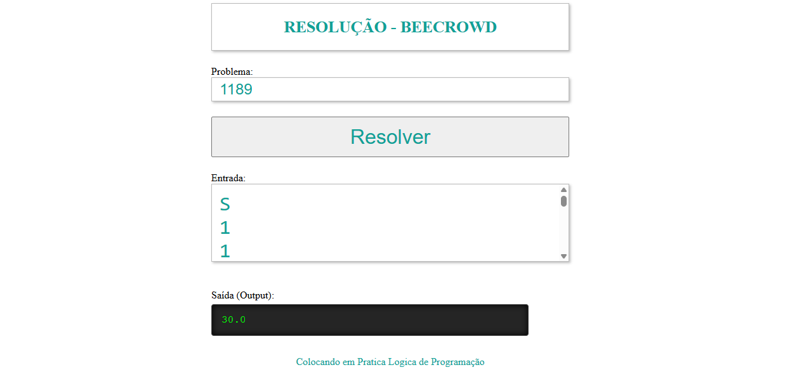

# 🐝 Lógica JS - Beecrowd

<p align="center">
  
  
  
</p>

<p align="center">
  
</p>

> Interface para testar resoluções de problemas do Beecrowd em tempo real.


Uma plataforma pessoal para testar e organizar resoluções de problemas do Beecrowd (antigo URI) utilizando JavaScript (ES6+).

## 🚀 Sobre o Projeto
Este projeto foi desenvolvido para facilitar o teste local de lógica de programação. Ele utiliza **Imports Dinâmicos** para carregar os scripts de resolução apenas quando solicitados, simulando o comportamento de um "Judge" online.

## 🛠️ Tecnologias Utilizadas
* **JavaScript (ES6+)**: Módulos assíncronos e manipulação de DOM.
* **HTML5/CSS3**: Interface inspirada no terminal de saída do Beecrowd.
* **Live Server**: Para gerenciamento de servidor local.

## 📁 Estrutura de Exercícios
Os exercícios estão organizados por categorias oficiais:
- `Iniciante`: Problemas básicos de lógica.
- `Matrizes`: Operações complexas em arrays multidimensionais.

## 📁 Estrutura de Pastas
- **img/**: Capturas de tela e recursos visuais.
- **exercicios/**: Resoluções separadas por categorias (ex: Iniciante, Matrizes).
- **src/**: Arquivos principais da aplicação (HTML, CSS, JS).

## ⚙️ Como Executar
1. Clone o repositório:
   ```bash
   git clone [https://github.com/dihegomartins/logica-js-beecrowd.git](https://github.com/dihegomartins/logica-js-beecrowd.git)
2. Abra a pasta raiz no VS Code.
3. Clique com o botão direito no index.html (dentro de src) e selecione "Open with Live Server".

## 🛠️ Como Testar
1. Digite o número do problema no campo **Problema** (Ex: 1189).
2. Cole a entrada de dados do Beecrowd na área de **Entrada**.
3. Clique em **Resolver** para ver o resultado instantaneamente na tela.